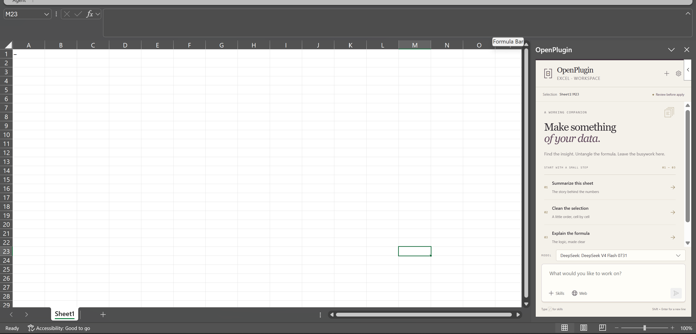
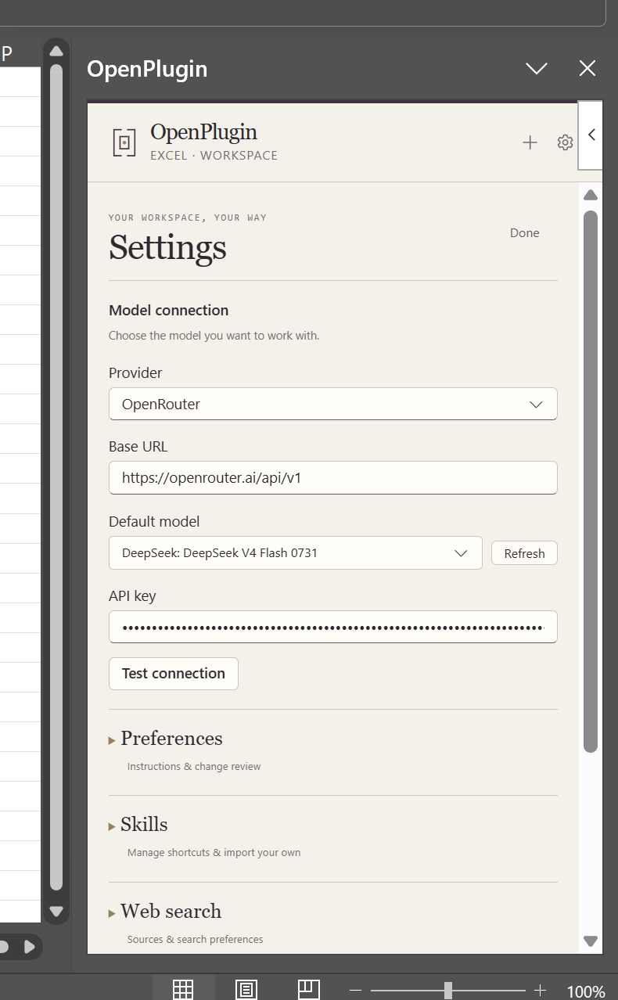

# OpenPlugin

Open-source LLM agent for **Excel**, **Word**, and **PowerPoint**. One Office.js add-in. Any OpenAI-compatible endpoint. [Agent Skills](https://agentskills.io/specification) as the extension model.

The add-in does **not** proxy your documents through a vendor cloud. Your API key stays in this Office profile. The model sees a token-budgeted snapshot plus the tools you approve.



## Why it exists

Chat sidebars are a crowded market. OpenPlugin is a **document runtime for agents**:

- Typed Office tools and a previewable changeset (not generated JavaScript by default)
- Portable `SKILL.md` packs, not a proprietary prompt dump
- Any OpenAI-compatible base URL. Presets: **OpenRouter**, **Ollama (local)**, **Custom**.
- Enterprise pays for **governance** (allowlists, audit, Entra, air-gap) — not for the right to use a model

## Requirements

- Node.js 20+
- Microsoft 365 desktop (Windows or Mac) for sideload
- An OpenAI-compatible endpoint that supports `POST /chat/completions` with tool calling

## Quick start

```bash
npm install
npm test
npm run companion          # optional; required for most Ollama setups
npm run start:excel
```

`start:word` and `start:powerpoint` sideload the same add-in into the other hosts.

To drive the sideloaded task pane from the CLI (WebView2 CDP — used by the coding agent, not a substitute for `npm test`):

```bash
npm run live -- excel start --force
npm run live -- excel ui screenshot
npm run test:live                 # Excel smoke: mock LLM → apply → assert a cell
```

On first run, Office will trust a local HTTPS certificate from `office-addin-dev-certs`. Then:

1. Open the **OpenPlugin** ribbon tab → **Open**
2. Gear → pick **OpenRouter**, **Ollama (local)**, or **Custom OpenAI-compatible**
3. **Test connection**
4. Use a prompt chip or type. Review the change list. **Apply**



## Excel custom functions

After sideload, Excel registers four `OP.*` formulas. They use the **same provider and model** you saved in the task pane (gear → Settings). If Settings has not been saved, the cell shows an error asking you to configure OpenPlugin.

These formulas write their answer **into the cell** (or spill into neighbors). They do not go through the task-pane review list.

| Formula | Use it for |
|---|---|
| `OP.PROMPT` | One question, optionally grounded in a range |
| `OP.MAP` | Apply the same instruction to every row |
| `OP.EXTRACT` | Pull named fields out of a block of cells |
| `OP.TRANSLATE` | Translate a cell or range into another language |

### `OP.PROMPT(prompt, [range])`

Ask the model anything. Pass a range as the second argument to ground the answer in sheet data. Returns a single string.

```excel
=OP.PROMPT("hello")
=OP.PROMPT("What is 17% of 240?")
=OP.PROMPT("Summarize this table in one sentence", A1:D20)
=OP.PROMPT("Which SKU has the largest quantity?", A1:C50)
```

### `OP.MAP(range, instruction)`

Runs `instruction` against **each row** of `range` and spills a single column of results (one cell per input row). Rows are sent in batches of 25.

```excel
=OP.MAP(A2:A10, "uppercase")
=OP.MAP(A2:A10, "translate to Spanish")
=OP.MAP(A2:C20, "write a 5-word product title from these columns")
=OP.MAP(B2:B50, "classify as bug, feature, or question")
```

If `A2:C20` is `name | color | size`, the third example returns one title per row, not per cell.

### `OP.EXTRACT(range, schema)`

Reads a range as text and returns **one row** of values, in the order of the comma-separated (or newline-separated) field names.

```excel
=OP.EXTRACT(A1:D20, "name, amount")
=OP.EXTRACT(B2, "email, phone, company")
=OP.EXTRACT(A1:A15, "invoice_number, date, total")
```

Example: `B2` contains `Ada Lovelace, ada@example.com, +1 202-555-0100`. Then `=OP.EXTRACT(B2, "email, phone, company")` spills `ada@example.com | +1 202-555-0100 |` (company blank if the model cannot find it).

### `OP.TRANSLATE(text, target, [source])`

Translates every cell in `text` into `target`. `target` and `source` may be names or codes (`"French"`, `"fr"`, `"ja-JP"`). Omit `source` to auto-detect. Empty cells stay empty. A single cell stays a single cell; a range spills a range of the same shape.

```excel
=OP.TRANSLATE(B2, "Spanish")
=OP.TRANSLATE(B2:B50, "fr")
=OP.TRANSLATE(B2, "Japanese", "English")
=OP.TRANSLATE(A2:C10, "German")
```

`=OP.MAP(A2:A10, "translate to Spanish")` still works; `OP.TRANSLATE` is the dedicated version that preserves grid shape (cell-by-cell, not row-by-row).

## Manual sideload

If debugging tools do not launch Office, start the dev server and upload the manifest:

```bash
npm run dev
```

In Excel/Word/PowerPoint: **Insert → Add-ins → Upload My Add-in** → choose `manifest.xml`.

## Endpoint notes

The add-in calls your endpoint **from the Office WebView**. The server must send CORS headers for `https://localhost:3000` (dev) or your hosted origin.

| Setup | Usually works direct? |
|---|---|
| OpenRouter | Often yes |
| Custom (Azure, vLLM, …) | Paste the **full** `/v1` or `/chat/completions?api-version=` URL. Server must send CORS, or use the companion |
| Ollama on localhost | Usually **no** without CORS. Run `npm run companion` and keep the Ollama preset |

OSS builds have **no telemetry**.

## Skills

Skills follow the [Agent Skills](https://agentskills.io/specification) spec (`SKILL.md` + YAML frontmatter). Bundled in v0.1:

- `selection-rewrite`
- `excel-range-cleanup`
- `word-memo-from-sheet`
- `ppt-outline-to-slides`

In the task pane, open **Skills** (puzzle icon) to list, enable, edit, duplicate, export, or delete user skills. **Save chat as skill** (composer Skills menu) drafts a skill from the current thread for you to review. Import a URL or paste a `SKILL.md` from that pane.

In the task pane, **History** (clock) lists saved chats for this Office host. **New chat** archives the current thread instead of deleting it. Rename or delete from that list. Chats are stored in this Office profile (IndexedDB).

Repo authors can still add a folder under `skills/` with `name` / `description` and `metadata.openplugin/hosts`. User skills are stored in this Office profile (IndexedDB), not in the repo.

## Repo

```
packages/core          Agent, LLM client, skills, tools, context compiler, Excel function helpers
packages/add-in        Task pane (React + Fluent UI)
packages/companion     Loopback CORS/Ollama proxy + audit + policy
packages/host-excel    Office.js Excel adapter
packages/host-word     Office.js Word adapter
packages/host-powerpoint
packages/live          WebView2 CDP driver for real Excel/Word/PowerPoint
packages/enterprise    Policy format, AppSource notes (commercial)
skills/                Bundled Agent Skills
pictures/              Task pane and settings screenshots
```

## License and enterprise

Core, add-in, hosts, companion (when it lands), and bundled skills are **Apache-2.0**.

`packages/enterprise` is the commercial governance layer (endpoint/model/skill allowlists, audit export, Entra ID, air-gapped installer). It is not required to use the agent.

See `CLA.md` if you contribute.

## Status

Sideloadable agent with a review-first task pane, OpenRouter / Ollama / custom presets, Excel `OP.PROMPT` / `OP.MAP` / `OP.EXTRACT` / `OP.TRANSLATE` functions, a loopback companion, and tenant `policy.json` via the companion. Unit tests run without Office (`npm test`). Real-host checks: `npm run live -- excel start --force` (Word/PowerPoint too) or `npm run test:live`.
